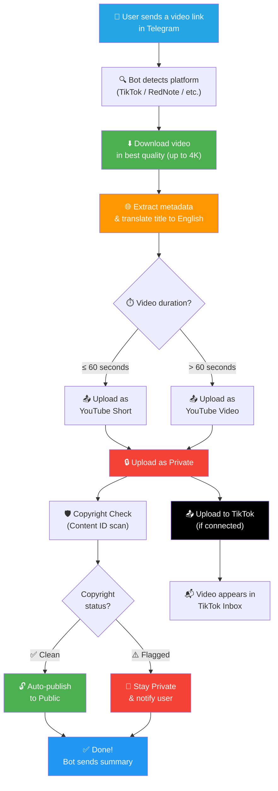
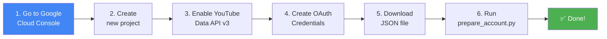
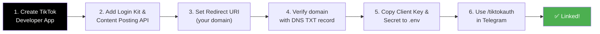
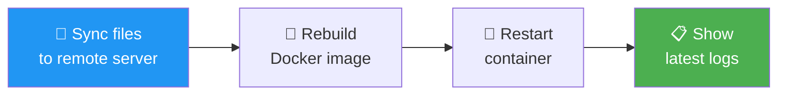

<p align="center">
  
  
  
  
  
  
</p>

# 🚀 Auto Post Bot

A powerful Telegram bot that automatically downloads videos from **TikTok**, **RedNote (Xiaohongshu)**, and other platforms, then uploads them to **YouTube** and **TikTok** simultaneously — with built-in copyright protection.

> **Send a video link → Bot downloads in best quality → Uploads to YouTube & TikTok → Checks copyright → Auto-publishes if clean** ✨

---

## ✨ Features

| Feature | Description |
|---|---|
| 🎬 **Multi-Platform Download** | Download videos from TikTok, RedNote, Instagram, Twitter/X, and 1000+ sites |
| 📤 **Dual Upload** | Auto-upload to both YouTube and TikTok simultaneously |
| 🛡️ **Copyright Protection** | Videos upload as private first → YouTube Content ID check → auto-publish if clean |
| 🌐 **Auto Translation** | Automatically translates foreign titles/descriptions to English using Gemini AI |
| 🏷️ **Smart Tags** | Extracts and generates relevant tags from the original video |
| 🖼️ **Auto Thumbnails** | Generates and sets custom thumbnails for YouTube uploads |
| 📊 **Multi-Account YouTube** | Support for multiple YouTube accounts with automatic rotation |
| 🔒 **Access Control** | Restrict bot usage to specific Telegram user IDs |
| 🐳 **Docker Ready** | One-command deployment with Docker Compose |
| 📡 **Remote Deploy** | Built-in `update.py` script to sync and deploy to remote servers |

---

## 🔄 How It Works — Flowchart



---

## 📋 Prerequisites

Before you start, make sure you have:

- ✅ **Python 3.13+** installed (or Docker)
- ✅ A **Telegram** account
- ✅ A **Google** account (for YouTube)
- ✅ A **Google Cloud** project (free tier is fine)
- ✅ *(Optional)* A **TikTok** account + domain name (for TikTok uploads)

---

## 🚀 Setup Guide — Step by Step

### Step 1: Clone the Repository

```bash
git clone https://github.com/hashira779/Auto_post.git
cd Auto_post
```

### Step 2: Create Your Environment File

```bash
# Copy the example config
cp .env.example .env
```

Open `.env` in any text editor — you'll fill it in during the next steps.

---

### Step 3: Create a Telegram Bot

1. Open Telegram on your phone or desktop
2. Search for **@BotFather** and start a chat
3. Send the command: `/newbot`
4. BotFather will ask for a **name** (e.g., `My Auto Post Bot`)
5. Then a **username** (must end with `bot`, e.g., `my_autopost_bot`)
6. BotFather will reply with your **bot token** — it looks like:
   ```
   8939476514:AAHA8RI3NAnzPrTMbe-6jAA7fAVmznzGeeI
   ```
7. **Copy** this token and paste it into your `.env` file:
   ```env
   TELEGRAM_BOT_TOKEN=8939476514:AAHA8RI3NAnzPrTMbe-6jAA7fAVmznzGeeI
   ```

---

### Step 4: Set Up YouTube API



**Detailed steps:**

1. Go to [Google Cloud Console](https://console.cloud.google.com/)
2. Click **"Select a project"** → **"New Project"** → give it any name → **Create**
3. In the left sidebar, go to **APIs & Services → Library**
4. Search for **"YouTube Data API v3"** → click it → click **Enable**
5. Go to **APIs & Services → Credentials**
6. Click **"+ Create Credentials" → "OAuth client ID"**
7. If asked to configure the OAuth consent screen:
   - Choose **External** → **Create**
   - Fill in App name (anything) and your email
   - Click **Save and Continue** through all steps
   - Under **Test Users**, add your Gmail address
8. Back in Credentials, click **"+ Create Credentials" → "OAuth client ID"**:
   - Application type: **Desktop app**
   - Name: anything (e.g., `Auto Post`)
   - Click **Create**
9. Click **Download JSON** (⬇️ icon) to save the file
10. Run the setup wizard:

```bash
python prepare_account.py path/to/downloaded_client_secret.json
```

11. Your browser will open — **sign in with your YouTube account** and click **Allow**
12. ✅ Done! Your credentials are saved to `credentials/`

> 💡 **Want multiple YouTube accounts?** Run `prepare_account.py` again with a different Google account. The bot rotates between accounts to bypass YouTube's daily upload limit.

---

### Step 5: Get a Gemini AI Key

1. Go to [Google AI Studio](https://aistudio.google.com/apikey)
2. Click **"Create API Key"**
3. Copy the key and paste it into your `.env`:
   ```env
   GEMINI_API_KEY=your_gemini_key_here
   ```

> Gemini is used to automatically translate video titles and descriptions from Chinese/Korean/Japanese to English.

---

### Step 6: Set Up TikTok *(Optional)*

> ⚠️ **This step is optional.** If you only want YouTube uploads, skip this entirely.



**Detailed steps:**

1. Go to [TikTok Developer Portal](https://developers.tiktok.com/) and create an app
2. Under **Products**, add:
   - **Login Kit** (grants `user.info.basic` scope)
   - **Content Posting API** (grants `video.upload` scope)
3. Under **Login Kit → Configuration**, set your **Redirect URI** to your domain:
   ```
   https://yourdomain.com/
   ```
   > ⚠️ TikTok does **NOT** allow `localhost`. You need a real domain.

4. To verify your domain, add a **DNS TXT record** at your domain registrar:
   - Type: `TXT`
   - Name: `@`
   - Value: `tiktok-developers-site-verification=YOUR_CODE_HERE`

5. Copy your **Client Key** and **Client Secret** into `.env`:
   ```env
   TIKTOK_CLIENT_KEY=your_client_key
   TIKTOK_CLIENT_SECRET=your_client_secret
   ```

6. Start the bot, then type `/tiktokauth` in Telegram
7. Click the login link, authorize your TikTok account
8. Copy the redirect URL from your browser and paste it back to the bot
9. ✅ Your TikTok is linked! Videos will now upload to both platforms.

> 📌 **Sandbox vs Production:** TikTok Sandbox mode lets you test the API, but videos won't actually appear on your account. To get real uploads, submit your app for Production review in the TikTok Developer Portal.

---

### Step 7: Run the Bot

#### Option A: Docker (Recommended for production)

```bash
docker compose up -d --build
```

#### Option B: Python (For development)

```bash
# Create and activate virtual environment
python -m venv .venv

# Windows:
.venv\Scripts\activate
# Linux/Mac:
source .venv/bin/activate

# Install dependencies
pip install -r requirements.txt
pip install -U yt-dlp

# Start the bot
python main.py
```

---

## ✅ Complete Setup Checklist

Use this checklist to make sure everything is configured:

```
[ ] 1. Cloned the repository
[ ] 2. Created .env file from .env.example
[ ] 3. Created Telegram bot and added token to .env
[ ] 4. Created Google Cloud project
[ ] 5. Enabled YouTube Data API v3
[ ] 6. Created OAuth credentials and downloaded JSON
[ ] 7. Ran prepare_account.py and authenticated
[ ] 8. Got Gemini API key and added to .env
[ ] 9. (Optional) Set up TikTok Developer App
[ ] 10. (Optional) Linked TikTok with /tiktokauth
[ ] 11. Started the bot with Docker or Python
[ ] 12. Sent a test video link in Telegram
```

---

## 📖 Bot Commands

| Command | Description |
|---|---|
| `/start` | Welcome message and quick start guide |
| `/help` | Detailed usage instructions |
| `/status` | Check bot status — uptime, connected accounts, disk space |
| `/accounts` | View all connected YouTube accounts and their quota usage |
| `/tiktokauth` | Connect your TikTok account for dual uploading |

---

## 📖 How to Use

1. **Copy** a video link from TikTok, RedNote, Instagram, Twitter/X, YouTube, or any other platform
2. **Paste** the link into your Telegram chat with the bot
3. **Wait** — the bot will show you real-time progress:
   - ⬇️ Downloading...
   - 🌐 Translating title...
   - 📤 Uploading to YouTube...
   - 📤 Uploading to TikTok...
   - 🛡️ Running copyright check...
4. **Done!** The bot sends you a summary with:
   - YouTube video link
   - Privacy status (Public ✅ or Private ⚠️)
   - Copyright status (Clean ✅ or Flagged ⚠️)
   - TikTok upload status

---

## 📁 Project Structure

```
Auto_post/
├── main.py                  # 🚀 Entry point — starts the bot
├── config.py                # ⚙️ Configuration loader (.env)
├── prepare_account.py       # 🔐 YouTube account setup wizard
├── update.py                # 📡 Remote server deployment script
│
├── bot/
│   ├── handlers.py          # 🤖 Telegram command & message handlers
│   └── keyboards.py         # ⌨️ Inline keyboard button layouts
│
├── downloader/
│   ├── engine.py            # ⬇️ Video download engine (yt-dlp)
│   └── metadata.py          # 🏷️ Metadata extraction & AI translation
│
├── youtube/
│   ├── auth.py              # 🔐 YouTube OAuth + multi-account pool
│   ├── uploader.py          # 📤 YouTube upload logic + thumbnails
│   ├── copyright_check.py   # 🛡️ Content ID copyright scanner
│   └── copyright_monitor.py # 👁️ Background copyright monitoring loop
│
├── tiktok/
│   ├── auth.py              # 🔐 TikTok OAuth flow (PKCE)
│   └── uploader.py          # 📤 TikTok upload (Web Video Kit API)
│
├── utils/
│   ├── logger.py            # 📋 Colored logging setup
│   └── link_parser.py       # 🔗 URL detection & platform identification
│
├── credentials/             # 🔒 OAuth tokens (git-ignored)
├── downloads/               # 📁 Temporary video files (git-ignored)
│
├── Dockerfile               # 🐳 Docker build configuration
├── docker-compose.yml       # 🐳 Docker Compose service definition
├── requirements.txt         # 📦 Python dependencies
├── .env.example             # 📝 Environment variable template
└── .gitignore               # 🙈 Git ignore rules
```

---

## ⚙️ Configuration Reference

All settings are configured through the `.env` file:

| Variable | Required | Default | Description |
|---|---|---|---|
| `TELEGRAM_BOT_TOKEN` | ✅ | — | Your Telegram bot token from BotFather |
| `GEMINI_API_KEY` | ✅ | — | Google Gemini API key for AI translation |
| `TIKTOK_CLIENT_KEY` | ❌ | — | TikTok app client key (optional) |
| `TIKTOK_CLIENT_SECRET` | ❌ | — | TikTok app client secret (optional) |
| `DOWNLOAD_DIR` | ❌ | `./downloads` | Video download directory |
| `DEFAULT_PRIVACY` | ❌ | `private` | Initial YouTube upload privacy |
| `AUTO_PUBLISH` | ❌ | `true` | Auto-publish after copyright check passes |
| `COPYRIGHT_CHECK_TIMEOUT` | ❌ | `300` | Copyright check timeout in seconds |
| `YOUTUBE_CATEGORY_ID` | ❌ | `22` | YouTube category (22 = People & Blogs) |
| `ALLOWED_USERS` | ❌ | *(all)* | Comma-separated Telegram user IDs |
| `LOG_LEVEL` | ❌ | `INFO` | Log level: DEBUG / INFO / WARNING / ERROR |

---

## 🔄 Deploying to a Remote Server

The bot includes a built-in deployment script for remote Ubuntu servers:

```bash
# Edit update.py with your server's IP, username, and password
python update.py
```

**What `update.py` does:**



1. Connects to your server via SSH
2. Syncs all project files (excluding `.venv`, `__pycache__`, etc.)
3. Rebuilds the Docker image with any code changes
4. Restarts the container
5. Displays the latest logs to confirm everything is working

---

## 🛡️ Security Notes

| ⚠️ Rule | Details |
|---|---|
| Never commit `.env` | Contains API keys and secrets |
| Never commit `credentials/` | Contains YouTube/TikTok OAuth tokens |
| Use `ALLOWED_USERS` | Restrict bot access to your Telegram ID only |
| Keep your repo private | Or ensure `.gitignore` covers all secrets |

The `.gitignore` file is pre-configured to exclude all sensitive files. If GitHub blocks your push due to secret scanning, you accidentally committed a secret — use `git filter-branch` to remove it from history.

---

## 🐛 Troubleshooting

| Problem | Solution |
|---|---|
| `TELEGRAM_BOT_TOKEN is not set` | Make sure your `.env` file exists and has the token |
| `No client_secret*.json files found` | Run `python prepare_account.py <path>` first |
| YouTube `uploadLimitExceeded` | Daily upload limit reached. Add more YouTube accounts with `prepare_account.py` |
| TikTok `scope_not_authorized` | Revoke app access in TikTok settings, then re-run `/tiktokauth` |
| TikTok `Client key or secret is incorrect` | Double-check the keys in `.env` match your TikTok Developer Portal exactly |
| TikTok video not appearing | If using Sandbox mode, videos won't appear. Submit app for Production review |
| `yt-dlp` download errors | Update yt-dlp: `pip install -U yt-dlp` |
| Docker build fails | Make sure Docker and Docker Compose are installed |

---

## 🤝 Contributing

Contributions are welcome! Feel free to:

1. **Fork** the repository
2. **Create** a feature branch (`git checkout -b feature/amazing-feature`)
3. **Commit** your changes (`git commit -m 'Add amazing feature'`)
4. **Push** to the branch (`git push origin feature/amazing-feature`)
5. **Open** a Pull Request

---

## 📝 License

This project is open source and available under the [MIT License](LICENSE).

---

## ❤️ Acknowledgements

- [yt-dlp](https://github.com/yt-dlp/yt-dlp) — The powerful video downloader engine
- [python-telegram-bot](https://python-telegram-bot.org/) — Telegram Bot API wrapper
- [Google API Python Client](https://github.com/googleapis/google-api-python-client) — YouTube API integration
- [Google Gemini](https://ai.google.dev/) — AI-powered title translation
- [TikTok Content Posting API](https://developers.tiktok.com/) — TikTok upload integration

---

<p align="center">
  Made with ❤️ by <a href="https://github.com/hashira779">hashira779</a>
</p>